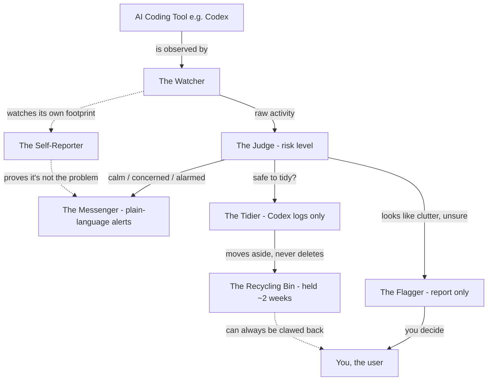
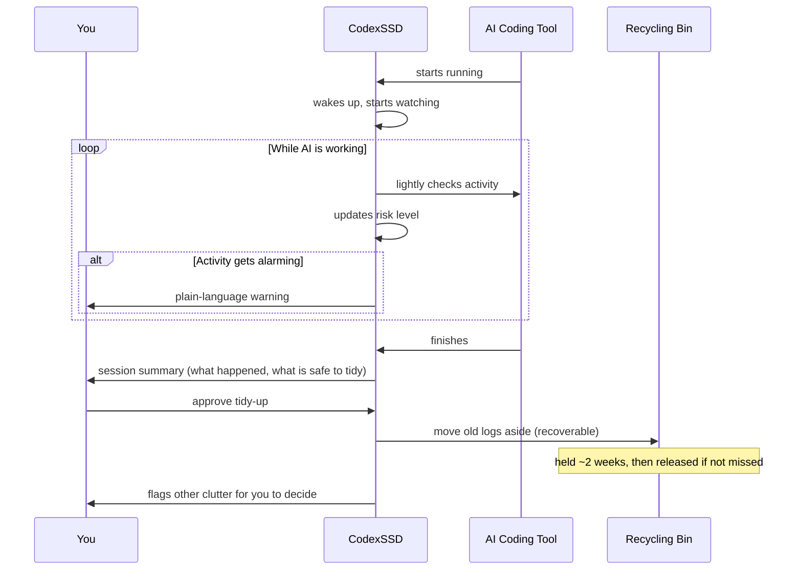

# Architecture

> Mirrored from the CodexSSD Notion spec (earlier drafts named the project "CodexGuard").

> How CodexSSD is put together, explained so anyone can follow it. The diagrams
> show the moving parts and how a typical session flows.

## The big picture

CodexSSD is one small program made of a few cooperating parts. Each part has one
job. The design rule above all others: **the tool must stay tiny and quiet — it
can never become the thing causing the problem it's meant to catch.**

## The parts, in plain terms

- **The Watcher** — keeps a light eye on what the AI tool is doing. Mostly
  sleeps; only pays attention when there's something to watch.
- **The Judge** — decides how worried to be (calm, mildly concerned, alarmed).
  Turns raw activity into a simple risk level.
- **The Messenger** — tells you what's happening, in plain language.
- **The Tidier** — the only part that ever touches files, and only safely: moves
  Codex's own logs into the recycling bin.
- **The Recycling Bin** — a holding pen where moved-aside files wait for ~2 weeks
  before being let go. Always recoverable until then.
- **The Flagger** — spots other clutter and writes it into a report for *you* to
  decide on. Never acts.
- **The Self-Reporter** — watches CodexSSD's *own* footprint and reports it, so
  the tool holds itself to the same standard it holds others.

### How the parts map to packages

| Part            | Package              |
| --------------- | -------------------- |
| Codex paths/logs| `internal/codex`     |
| The Watcher/Judge | `internal/monitor` |
| The Tidier / Recycling Bin | `internal/cleaner` |
| Prompt rules ("please behave") | `internal/agent` |
| Session history (JSONL) | `internal/recorder` |
| The Self-Reporter | `internal/self`    |
| CLI entry point | `cmd/codexssd`       |

## How the parts fit together

## What a typical session looks like

This is the journey from "AI tool starts working" to "you get a clean report."

## The safety rules baked into the design

These aren't features you turn on — they're rules the architecture is built
around:

- **The Tidier is the only part that touches files**, and it only ever touches
  Codex's own logs. Your real work is untouchable by design.
- **Nothing is ever truly deleted by the tool** — only moved to the recycling
  bin. Permanent deletion always requires you to go out of your way.
- **The tool checks something isn't busy before touching it.** If Codex is
  mid-write, hands off.
- **When uncertain, the Flagger reports — it never resolves.** Doubt always
  defers to you.
- **The Self-Reporter keeps the tool honest** about its own disk, memory, and
  processor use.
